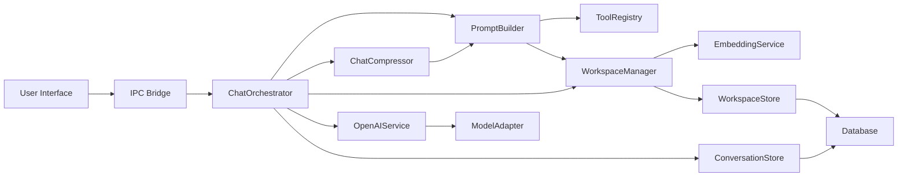
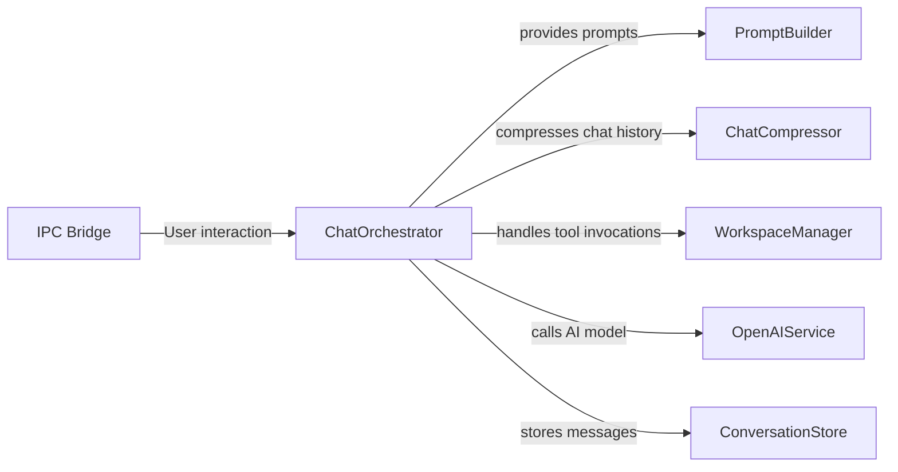
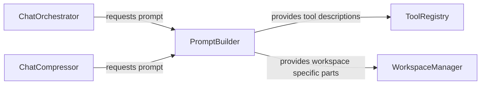
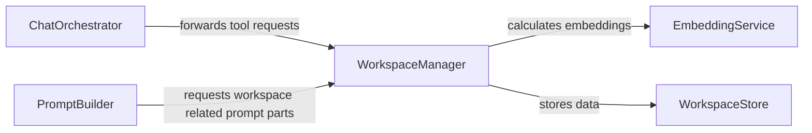
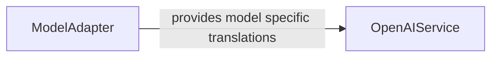

One of the easiest and most convenient ways of learning new technologies is by using them. Everything AI related is full of buzzwords: from RAG-Systems over Agentic Memory to Classification Heads and Embeddings - it is hard to get an overview and even harder to stay up to date. 

So that's the reason I started this side project: to become more familiar with all that and learn, how to build modern, AI-oriented applications. And I would like to share my journey with you.

<!-- more -->

# Introducing Trunky

I want to introduce you to Trunky - a learning-first AI project built with Electron, React, and TypeScript. It is a playground for experimenting with large language models, tool orchestration, workspace memory, and prompt engineering.

In this first article I want to explain what Trunky is, and how its architecture is shaped around AI technologies. I explain the key decisions I have made and how they affect the project as it grows, what obstacles I ran into and hopefully how to avoid them, when starting an AI centric app like Trunky again.

## Motivation

Trunky’s purpose is not to be a mature application. Its purpose is to:

- show how AI backend architecture can be built for tool use
- demonstrate workspace memory and retrieval patterns
- experiment with prompt engineering in a real desktop app
- provide a personal lab for comparing providers and building AI workflows
- a case study how even small, locally hosted AI models can be used to build apps, that would not be possible a few years ago

If you care about how to design an intelligent desktop assistant, Trunky might be a useful case study.

## What Trunky Is

The initial idea behind Trunky was, to build a simple chat application with a locally hosted AI model, which then could be used to experiment with more advance features.  The goal has become to extend Trunky with to become an automatic knowledge-management system, that gathers, organizes and retrieves information out of chat conversations in a way that feels *agentic*: autonomously, planned, purposeful and somehow intelligent.

Today Trunky is:

- a desktop AI chat application that
  - organizes chats in conversations
  - implements different strategies to prevent token overflow
- a workspace-based knowledge assistant that enables the AI model to interact with workspace data through tools
- a sandbox for trying ideas like semantic search, tool-enabled reasoning, and multi-model integration

In the image above you can see Trunky's main screen. Like many other AI chat applications you have your chat history and input area in the midddle and some side panes to manage conversations and workspace information.

## The Overall Function

Trunky's UI is divided into four pages which you can navigate on the left navigation bar:

**Chat Page**
The main view of the application. Here you can chat with the LLM model and use it to store and access knowledge-items. It works like a mini-RAG-system: RAG (**R**etrieval **A**ugmented **G**eneration) is a framework that allows an AI model to access and process data, that have not been part of their training, for example a companies database without having to put it into the (often limited) context window.

Trunky can automatically filter information from your conversation and stores them in the workspace. The software then uses this data as an additional source of information, like in the example below.

You can see that Trunky used the **searchSemanticInformation**-tool to gather information about an upcoming trip to Denmark, which Trunky was told about in another conversation and is not part of its current chat-history.

In Trunky, you can always check, what information it has in its store using the **Workspace Inspector**.

Here you can not only see what is currently inside of your workspace, you can manually change these items, out-date them or restore a version from the past.

**Workspace Page**
The managament page for all workflow related stuff. Here you create and manage your workspaces. Each workspace is independent of the others. You can import knowledge before or while you are working with it together with the AI model.

**Tools Page**
A simple page where you can decide, which tools will be available for the AI model to use. Tools are used to let the AI model interact with the world beyond sending text messages back to the user. Commoon tool-usages are for database-access or web-searches, but it could be anything as long as the AI model understands it's purpose and how to use the tool.

It is not always desirable to give an AI model access to all tools at the same time. Therefore you can select a combination of tools within the tools page that fits best to your specific use case.

**Settings Page**
Here you configure your application. You set up the basic connection to the model host system (like Ollama or LM Studio), select the AI model(s) you want to use and define some basic parameters and behaviors.  

## Where To Find Trunky

Link to github project, TBD

---

## So What Is Inside?

Before we start to dive deeper into certain aspects of how an AI centric application with an *agentic* like feeling could be done, I want to give you an overview of Trunky's architecture.

## Architecture Overview

### AI Orchestration: The Heart of Trunky

The central architecture is in `ChatOrchestrator.ts`.

This component:

- receives chat requests from the UI via IPC
- loads conversation history from `conversationStore`
- determines which model to use
- builds prompt context
- calls the model through `openAIService`
- handles tool invocation and tool results
- stores assistant replies and tool interactions

That means the real architecture is about flow control and AI decision making.

### Prompt and Context Management

`PromptBuilder.ts` is the AI instruction layer.

It provides:

- system prompt construction for tool-enabled chat
- workspace-specific context injection
- strict tool usage rules and agent behavior
- token estimation and overflow handling
- conversation summarization and compression prompts

This file is where the assistant gets its “mental model” of the workspace and its operational rules. It is easy to underestimate the impact of your instructions and exact formulations in your promps, so this part may seem less important than it actually is, so I put it in second place to emphasis its relevance.

### Workspace Memory and Knowledge Tools

The workspace subsystem is managed by `workspaceManager.ts`.

This backend layer:

- maintains workspace metadata with WorkspaceRegistry
- stores workspace data in separate databases via WorkspaceStore
- executes data operations through WorkspaceDataService

The layer supports backend capabilities such as:

- `inspectWorkspace` for general information about the current workspace
- `retrieveInformation` for information about a specific subject/entry
- `searchSemanticInformation` for a broader, more flexible search
- `updateInformation` to update existing or inserting new information
- `forgetInformation` to invalidate a specific information (soft delete)
- `restoreInformation` to restore an information that has been (soft) deleted before

That is the memory layer that makes Trunky more than a generic chat UI.

### Model Provider and Adapter Layer

Trunky is intentionally designed to be flexible with model providers.

`openaiService.ts` abstracts model calls, while adapters like:

- `OpenAIAdapter.ts`
- `Hermes3Adapter.ts`

allow the same orchestration logic to target different API styles. This is a key design decision for experimentation.

### Tool-First AI Design

The app is built around a tool-oriented AI workflow.

The prompt logic in PromptBuilder:

- defines the assistant as a “Workspace Knowledge Assistant”
- instructs it to prefer tools when dataset or memory is needed
- describes available workspace tools and how to use them
- encourages chaining tool calls instead of relying on hallucinated answers

This is the most AI-focused architectural decision in Trunky.

### Frontend as Runtime Shell

The UI is still an important part of Trunky.

`App.tsx`, `ChatPage.tsx`, and `WorkspacePage.tsx` provide together with the pages they allow to navigate between:

- the chat interface
- workspace management controls
- model/settings configuration
- a workspace inspector
  
The frontend is best described as the runtime shell for the backend AI architecture. It makes the experiment accessible, while the real value is in the backend AI logic.

## Key Decisions For Development

**Model Hosting**
I decided not to focus on model infrastructure aspects by including model loading/management in the Trunky application. Instead I wanted to focus on consuming AI services while still being able to use a local model. Therefore I chose LM Studio for hosting as it allowed me to easily switch between models and try different settings within an easy-to-use graphical UI.

**Choosing a Model**
When choosing a model you have a broad variety of options. Which is best depends on many factors, but for my locally hosted model the most important where:

- memory requirements
- the basic intelligence
- special capabilities

For my hardware (a MacBook M1 with 32 GB of RAM), a model with about 9B parameters seems to be the sweet spot: it gives me enough intelligence for the tasks I have in mind while not consuming too much momory.
Larger models may fit into my RAM but I also had in mind, that I want a second model for embeddings working in parallel, so I rather did not want to push it to the limits.
Keep in mind that a larger token window will also increase RAM consumption of the model. This comes in handy for development when you want to test AI-interaction without chat compression which can be very time-consuming and adds another layer of complexity while debugging.

When it came to model capabilities I tried different freely available models and chose the `Hermes3-llama3.1-8B` for development and testing. It is specially trained for tool-usage and instruction following which is necessary for Trunky's core features. And it felt already less *chatty* than other models that are trained for general user interaction. In later experiments I also switched to `Qwen3.5-9B` which feels different, less strict and more creative even when using tools.

**Technology Stack**
When it comes to AI development, Python seems to be the best choice for programming language. The lack of good UI frameworks for Python (my opinion) and knowing, that I would rather not host the model inside my application, I decided against Python and gave Electron with React and TypeScript a try. That said, if you just start and want to try out something fast without building a whole application around, Python still is the way to go for most cases.

**AI Tool Usage**
For that *agentic feeling* I wanted to achieve, where the application develops and follows a task over multiple execution steps, tool usage by the AI model was a necessity. When the project first started, tool selection was considered to be very dynamic and extensible. While this is still a goal, the focus has shifted away from that flexibility. At this point, Trunky comes with a set of six built-in tools that allow workspace interaction only, keeping it focused on its main purpose.

**Semantic Search**
This feature was not on the list when Trunky started as it introduces a whole new case for AI usage to the project. Conventional search approaches did not give me the results i wanted or needed, so semantic search was introduced based on embeddings generated by the embedding model `text-embedding-bge-m3`. With its help, for every workspace entry an embedding is created as soon as it is stored and also kept updated when the content of an entry changes. The AI profits from semantic search, allowing it to retrieve information without having to rely on exact matching terms.

**Workspace Memory**
Dividing the knowledge entries into isolated workspaces instead of handling a global knowledge base enables not only tests to be much easier but is also gives Trunky more flexibility and its use cases. Conversations are tied to a workspace and share their knowledge. That design enables me to determine, which information is taken directly from chat history and which has to be retrieved from the knowledge store without having to reset the application multiple times during testing. It also allows workspace specific prompts which can help to control AI behavior without rebuilding the whole system prompt.

## Summary

Trunky is a learning-first AI desktop project that explores how modern applications can combine local model experimentation, tool-enabled workflows, and workspace memory. This first article in this series described the motivation behind the project, the core architecture, and the key decisions that shaped the proof-of-concept implementation—from using model adapters and semantic search to choosing Electron, React, and TypeScript for the UI.

The goal is a practical exploration of how an AI assistant can behave more like a knowledge-aware workspace companion than a plain chat bot. As Trunky evolves, it should become better at remembering relevant information, using tools intentionally, and retrieving structured knowledge from a shared workspace.

## What’s Next

In future articles, I will dive deeper into the following features of Trunky and explain their concept, the ideas behind and how they have been built:

- Workspace memory and semantic search
- Prompt engineering and tool orchestration
- Conversation summarization and token economy
- Model adapters and provider abstraction
- UI/UX choices for AI desktop tools
